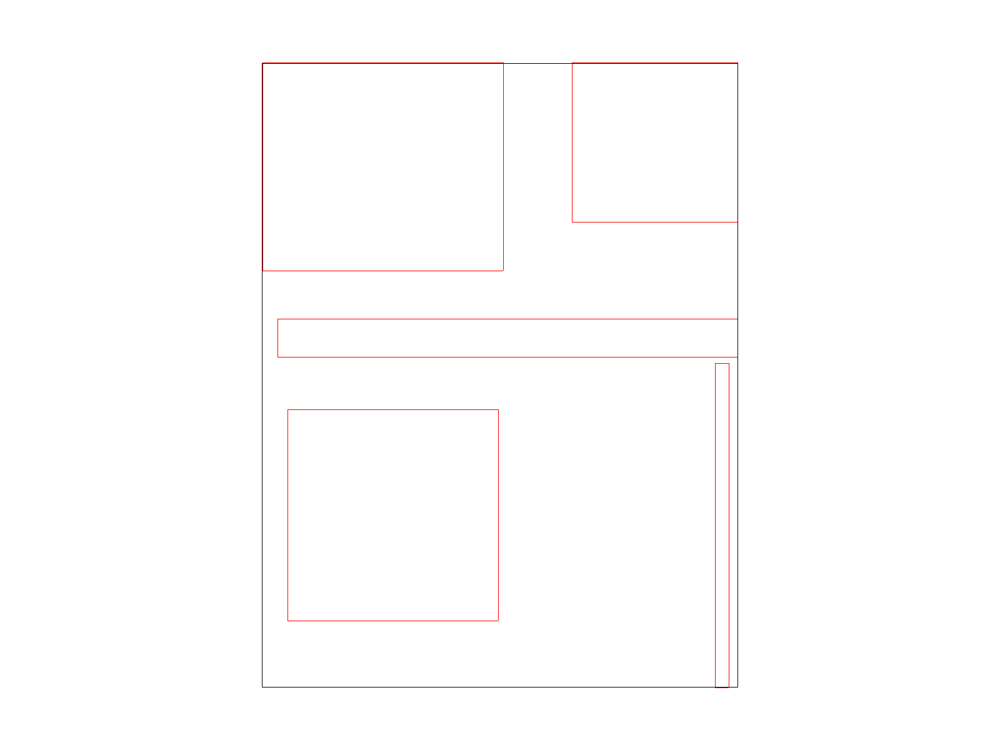

# Project 1

# Part 1 (Triangle rasterization)
My project uses the very simple sampling-based method for rasterizing triangles as described in lecture.

First, we compute the bounding box for each triangle:

This is done by simply computing the minimum and maximum x and y positions.