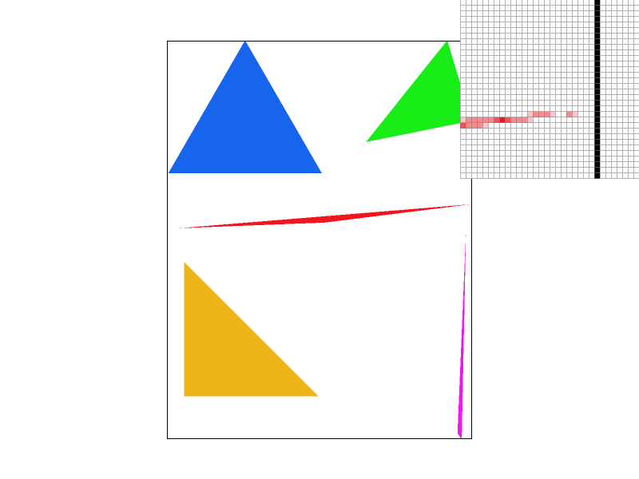
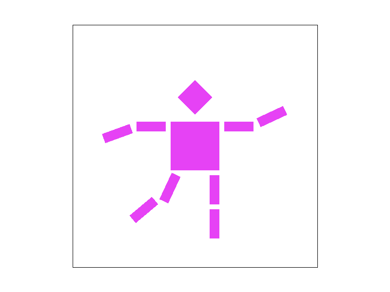
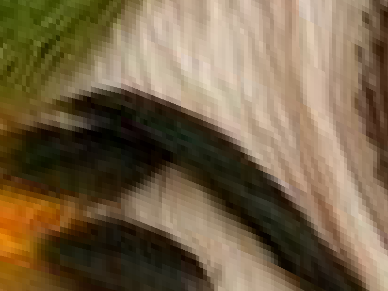
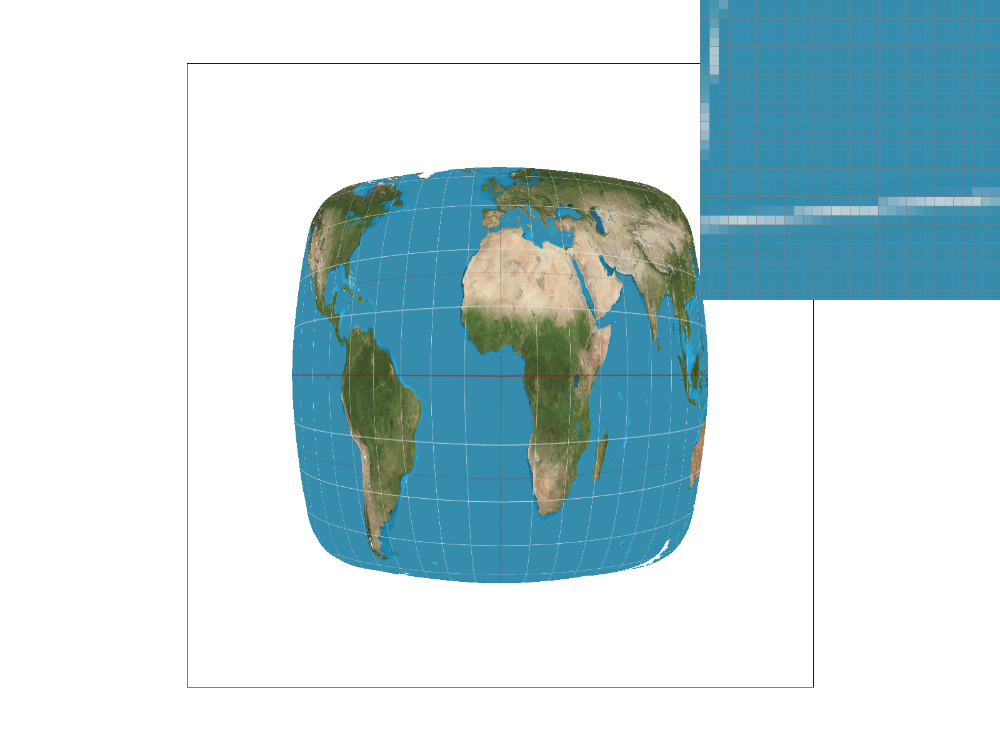
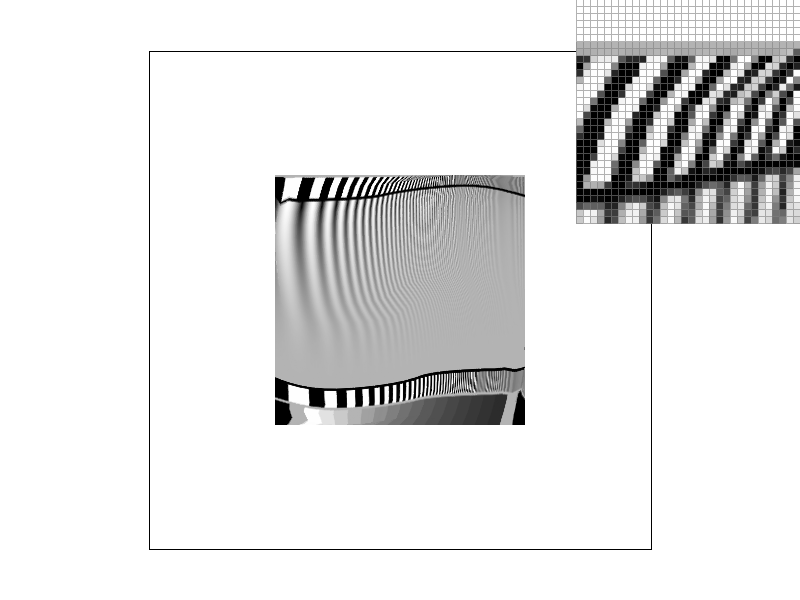

# Project 1

## Project Overview
This project primarily dealt with the development of an SVG rasterization pipeline for points, lines, and triangles which can, optionally, be transformed, colored according to a barycentric system, or textured using an image. Special care was given throughout the project to generating high quality rasterization by supporting both super-sampling to improve quality for smoother edges and coloring where continuously defined as well as more interesting texture oriented anti-aliasing features like bi-linear pixel sampling and mipmap level interpolation. When taking all of these features together, we've created a not only fairly capable but indeed high quality SVG rendering engine which can be used to display very complex images.

Through this project, I feel that I've learned a *lot* about different anti-aliasing techniques. Specifically, while I feel I had a general grasp on the continuous-mipmap level texture filtering technique after our course lectures on the topic, actually implementing it provided a much stronger understanding of it. Additionally (and somewhat unexpectedly), this project gave me a much deeper understanding of the LLVM compiler infrastructure as I attempted to root-cause what turned out to be a miscompilation stemming from incorrect vectorization. This tangent, while not exactly relevant to the class, was interesting both to my own interests in programming languages/compiler research as well as because it gave me a much more low-level look at triangle intersection code.

## Part 1 (Triangle rasterization)
My implementation uses a very simple sampling based method for rasterizing triangles.

First, we compute the bounding box for each triangle:


This is done by simply computing the minimum and maximum x and y coordinates across all of the triangle's vertices. This bounding box gives us a much smaller sample space from which we can perform intersection tests and is thus performance critical.

Next, we arbitrarily define the three lines L\_{01}, L\_{12}, L\_{20} and consider only the portion of those lines that falls within the earlier defined bounding box (i.e. the line tangent vectors):


Then, for each point in the bounding box, we can consider which "side" of the line it lies on. If the pixel lies on the same side of each line, we know the pixel must be contained within the triangle and may thus color that pixel appropriately. This leads to the following final rasterization result for `basic/test4.svg` (default viewing parameters):


While this works and the triangles are in fact rasterized correctly, this does lead to a great deal of aliasing. One particularly extreme case of this can be seen in the pixel inspector where the red triangle, in addition to its abundant jaggies, appears to become discontinuous for a period since it becomes so narrow as to not be considered inside of any of the pixels in the region. This is the correct behavior but it is not very visually appealing.

From a performance standpoint, we can conclude that this algorithm is no worse than one that checks every sample within the bounding because this algorithm is constrained to checking *only* the pixels in the bounding box. In other words, this algorithm is not worse than one that does this because the algorithm presented here does precisely that.

## Part 2 (Antialiasing by supersampling)
Conceptually, supersampling antialiasing (SSAA) works to combat aliasing by simulating a higher sampling frequency (thereby increasing the Nyquist frequency) and then lowering the higher frequency samples into the lower frequency screen sample rate. In effect, this means we render a scene at a much higher resolution and then downsampling (typically by averaging neighboring samples). This is useful in practice since it allows us to provide much smoother edge transitions.

To add SSAA to our rasterization pipeline, we had to make a handful of changes. 

To begin, we defined our SSAA rate as the number of pixels that are unified to create one super pixel. This means that an SSAA rate of 4x means four pixels (arranged in a 2x2 square) are averaged together to form each screen pixel. We store this square-rooted rate (ie the dimension of one edge of the square) in the rasterizer's `sample_rate` field as we have no actual use for the non-square rooted size and because computing the square root is computationally expensive and thus something worth caching.

Next, since we now wish to render more pixels, we need an appropriately large place to store them. This meant that we needed to scale up the `sample_buffer` by a factor of  `sample_rate` in each dimension. This is very expensive (costing 16x more memory for 16x SSAA) but doing so vastly simplifies the pipeline since it allows us to directly render the entire scene into the sample buffer and then, later, downsample into the frame buffer instead of attempting to perform both operations simultaneously.

With this new, expanded sample buffer, we now need to render into it. This required two changes. 

First, to draw points and lines correctly (and un-supersampled per the spec), we simply modified the `fill_pixel` to translate from frame buffer coordinates to sample buffer coordinates by scalding each dimension up by `sample_rate` and then drawing a cluster a `sample_rate` by `sample_rate` square centered approximately at that newly scaled up position. This preserves the existing behavior for points and lines since the later down sampling algorithm will merge all the pixels in this square into one super pixel in the frame buffer.

Finally, with all elements rendered into the frame buffer, we are now prepared to reduce the sample buffer into the frame buffer. We did this by modifying the `resolve_to_framebuffer` function to iterate the frame buffer and average the colors of the corresponding `sample_rate` by `sample_rate` square of pixels in the sample buffer into one super pixel in the frame buffer. Once this processing step is complete, the SSAA image is now available in the frame buffer in its final form.

As a result of all this, triangles have significantly smoother edges since the sharp transition which appears in the sample buffer is averaged away into an appropriately smooth edge which approximates the very high frequency change, as desired. This provides a very visually appealing effect:

| 1x SSAA | 4x SSAA | 16x SSAA |
|:---:|:---:|:---:|
||||

By revisiting the pointy end of red triangle we observed in part 1, we can very clearly observe both the effect and extent of the varying levels of SSAA. SSAA at 1x, as expected, results in no changes since the super pixels are made up of just one sample each. In 4x, however, we start to see significant improvement both in the jaggedness and the size of the discontinuity because SSAA 4x is able to communicate varying levels of "edge present" through *hue* (unlike its binary 1x counterpart) due to its supersampling behavior. Thus, SSAA 4x is able to smoothly communicate the edge fall off behavior happening inside a single pixel by observing the edge fall off behavior across the four sub-samples. In 16x, we see an effect similar to 4x but slightly more pronounced. Notably, this rendition has no visible discontinuities. This is possible in 16x but not 4x because the larger sample footprint of 16x allows it to capture the extremely skinny part of the triangle due to its much smaller sub-pixels and thus much higher sampling frequency.

## Part 3 (Transforms)
In this part, we implemented the SVG scale, rotate, and translate transformations. I used these transformations to create a robot ice skating. Look at her go :)



## Part 4 (Barycentric coordinates) 
In this task, we implemented barycentric color interpolation for our triangles.

Put succinctly, a barycentric coordinate system is an interpolation strategy in which various `n` samples are linearly and continuously interpolated according to an `n - 1` dimensional coordinate in the interior of that geometric object. The closer a point in the object is to a specific vertex, the more heavily that vertex's sample is weighted in the combination while still maintaining that the sum of the weights for each sample is equal to exactly 1.

<center>

</center>

We can see this more easily in the case of a triangle (`n = 3`). In the triangle above, we have the color green associated with the top vertex V\_g, red with the bottom left vertex V\_r, and finally blue with the bottom right vertex V\_b. The barycentric coordinate system is then used to interpolate the color across each of the points in the triangle. 

We can make a few key observations. First, the points exactly at the vertices are exactly the sample colors (i.e. the color at point V\_g is exactly (0, 1, 0)). This makes sense since the point is maximally far from both V\_r and V\_b and thus must be maximally green. More interestingly, however, is the point exactly halfway between V\_r and V\_b. This gives us a nice purple which, if we recall from art class, is a mix of half red and half blue. Specifically, the shade here is (0.5, 0, 0.5) since it is a mix of half of the red sample and half of the blue sample since we are maximally far from green in this case. A similar effect may be observed at the other halfway edges (red-green forms yellow, blue-green forms teal/cyan). While seeing this same concept when moving off of the edges and into the interior space of the triangle is a bit trickier, we can see it at work in that there are no visibly sharp changes in color moving a single step in any direction on the triangle since the weights (and thus the mix) change smoothly due to the barycentric coordinate system.


We can use barycentric coordinates to smoothly texture a variety of useful images. We implemented this in our project by modifying the `rasterize_interpolated_color_triangle` function to render triangles in a way similar to our standard triangle rasterization pipeline except instead of using a constant, fixed color we use a barycentric coordinate system with colors fixed to each vertex and then interpolate for each pixel inside the triangle. This provides smooth triangle coloring and allows for the construction of this color wheel (`basic/test7.svg`, default viewing parameters/SSAA=1x):


## Part 5 (Pixel sampling/texture mapping)
While the textures we are applying to our triangles already rasters, a mapping pseudo-step function may be constructed that perfectly maps f(x, y) to the color data at x, y in the rasterized image when sampling the raster at a 1:1 scale.

We run into the familiar set of problems when attempting to deviate from this 1:1 scale in either direction. This is to be expected, naturally, because our raster is a function that we must sample. For this reason, we can and often do refer to texture mapping as "pixel sampling" since the problems are one and the same. Just as with other functions, sampling it too slowly can result in aliasing because we miss detail where as sampling it more quickly than the underlying raster supports can result in missing data which must be interpolated.

This last issue about interpolation is one we tackled in this problem. Here we implemented two separate sampling schemes, namely nearest and bi-linear sampling. Nearest is the most basic scheme as it simply "snaps" coordinates to the nearest valid sample in the raster. This can result in visible blockiness since multiple different pixels may be returned the same sample from the raster under this scheme. To rectify this, another sampling scheme known as bi-linear sampling may be used. Bi-linear sampling linearly interpolates the color of a sample from the four nearest pixels. This means that different samples, even when they have the same underlying four nearest pixels, will have differing sample data, which provides a smoother overall appearance. 

We can see a striking difference between these sampling methods by zooming into an image:

| Nearest | Bi-linear |
|:---:|:---:|
|||

In the nearest image, we can clearly see sharp edges between individual pixels from the raster whereas the in the bi-linear image the transition between raster pixels is much smoother and something that can be easily overlooked.

Finally, we compare these two sampling methods and their interactions with SSAA and their impact on anti-aliasing. 

| 1x SSAA, nearest | 16x SSAA, nearest |
|:---:|:---:|
|||

| 1x SSAA, bi-linear | 16x SSAA, bi-linear |
|:---:|:---:|
|||

While, unsurprisingly, 16x SSAA of either interpolation scheme performs better than either 1x SSAA interpolation scheme, 1x SSAA bi-linear interpolation trades blows with 16x SSAA nearest despite needing just 1/16th of the memory and 1/16th of the processing time, which suggests it is a very good technique for efficiently resolving texture aliasing. This is not a terribly suprising result as bi-linear interpolation performs a similar function as 4x SSAA in that it captures more detail by combining neighboring samples except that it requires much less memory. Between the two 1x SSAA interpolation methods, bi-linearly again, unsurprisingly wins due to its increased ability to capture detail. A similar trend appears with 16x SSAA where bi-linear sampling plays off of 16x SSAA to produce a very smooth result whereas 16x SSAA struggles due to nearest magnifying errors.

Generally, however, we may conclude that the difference between these two sampling methods is most severe when the frequency is very high and the resolution of the underlying raster is very low (i.e. a hugely blown up 2x1 black and white rectangle). In this case, nearest will be forced to pick one of the two colors for all pixels on screen leading to severe blockiness whereas bi-linear will be able to more appropriately cope with both the frequency and aliasing issues by smoothly blending.

To actually implement these features, we implemented the `rasterize_textured_triangle` with a similar rasterization procedure except color is selected for each interior pixel by first barycentrically interpolating a screen coordinate into a texture coordinate (i.e. u,v space). This coordinate was then used to lookup the texture pixel using one of two methods depending on the configuration. First, we have `Texture::sample_nearest` which simply scaled the (u, v) coordinate into the texture space and clamped to the nearest pixel. Second, we have the `Texture::sample_bilinear` function which performs bilinear sampling as described above by selecting the four (or fewer, on edges) nearest pixels and lerping-ing them together to compute the interpolated color. 


## Part 6 (Level sampling)
To understand level sampling, it's first worth discussing the problem it aims to solve. As  touched on in part 5, rasters may be represented as a 2D mapping function f(x, y). Like any sampling problem, attempting to sample too quickly causes blockiness or too slowly causes aliasing. Part 5 dealt with the former case and bi-linear filtering offered an effective means to interpolate missing data due to too rapid sapling, but we still have not coped with the latter issue which occurs when the raster we are sampling from is too large for the display size and thus smaller/higher frequency details are lost/aliased.

Level sampling offers a solution to this issue. By pre-computing progressively smaller, pre-filtered variants of a texture (termed collectively as "mipmaps"), the rendering pipeline can sidestep this issue altogether simply by selecting the appropriate size texture for the scale that it is attempting to render the texture at such that it is never attempting to render a larger texture on to a smaller surface. This helps the renderer entirely avoid this variant of aliasing since it never is in a situation in which it has to minify textures since it always has a texture at the same or smaller size available to it. This leaves it with just the issue of scaling up textures, which is easily and efficiently resolved through our earlier implemented texture filtering techniques in part 5.

We implemented two variants of level sampling in our project; namely, nearest and linear. For each, the texture level was computed by observing the rate of change in texture coordinates between individual pixels in both the x and y direction (larger first derivative values, naturally, indicating a larger display size due to rapid coordinate change) and then using the maximum rate of change to compute the level. These levels are then interpreted different by each scheme. In nearest, the level is simply snapped to the nearest mipmap level (clamping at the edges) and the pixel is directly sampled from that mipmap texture whereas in linear the two nearest levels' samples are linearly interpolated according to the continuous level value in order to provide a mixed approximation of the two.

To implement this, we restructured our texture sampling subsystem to perform both pixel sampling and level sampling together via a single `Texture::sample` invocation which dispatches to the appropriate combination of internal functions. Critically, however, we perform pixel sampling *before* level sampling to ensure that the nearest/linear sampling is mixed into later calculations to ensure that the maximum amount of information is available in the end calculation.  

To showcase the performance of the nearest level sampling engine, we now consider four samples which use the two different pixel sampling methods from above and compare them across the L\_ZERO technique (no mipmap-ing) and L\_NEAREST (nearest):

| L\_ZERO, P\_NEAREST | L\_ZERO, P\_LINEAR | L\_NEAREST, P\_NEAREST | L\_NEAREST, P\_LINEAR|
|:---:|:---:|:---:|:---:|
|||||

From this, we can make some key observations. First, and most poignantly, applying the correct mipmap level is significantly more important than sampling well when aliasing is a concern. This is because, despite bi-linear sampling performing well against aliasing in part 5, it is much easier to *prevent* aliasing from occurring in the first place than it is to attempt to recover from it through averaging after the fact. This is visible between the zero, linear and nearest, nearest images in which even with the inferior sampling algorithm the later displays significantly less aliasing. Despite this, however, we should not conclude that good sampling is totally irrelevant. Rather, the different between nearest, nearest and nearest, linear is still quite visible, albeit less severe and bi-linear sampling still results in better quality.

### Conclusion 
With all these techniques under our belt, it now comes time to consider all of them together. We analyze each under the categories of speed, memory usage, and antialiasing power.

Where better to start than where it all began: SSAA! SSAA is best characterized as the sledge hammer of antialiasing. It is very effective in nearly every situation and it requires almost no implementation effort since it increases the actual sample rate to capture more detail. Unfortunately, however, it has such severe computational and memory penalties (upwards of 16x as much for SSAA 16x) that it is almost unacceptably expensive at higher levels for any sort of real-time applications without extensive hardware parallelization. This means that although SSAA is a great tool for 3D rendering and movies in which waiting for a higher quality result is okay, it is not so much a great choice for something like a video game on an embedded device like a smartphone where we have both hard timing deadlines and significantly stricter CPU/GPU/memory budgets. 

Pixel sampling is the cheapest remedy of the bunch but, unfortunately, has one of the more minor impacts. While the nearest sampling technique is essentially free in that it is the minimum viable functionality required to texture a surface, it also provides the worst quality as it does nothing to avoid any sampling errors. Bi-linear sampling provides good local anti-aliasing. By the nature of its implementation, it can be thought of as a cheap approximation of SSAA 4x but with the added benefit that it does not require any additional memory (though still incurring a small number of additional computations per pixel, like SSAA 4x). For this reason, I feel that bi-linear texture sampling is a benign good feature in almost any rendering pipeline, regardless of the real-time constraints, due to its light budget and relatively good quality boost over the naive alternative of nearest sampling. 

Finally, we consider level sampling. Level sampling is a *very* powerful tool for stopping aliasing before it occurs, and thus helps amplify the strength of other later mechanisms rather than creating more work for them. This makes level sampling a very impactful and vital technique for addressing aliasing. It does, however, incur a non-zero memory cost (up to \~33%), which can be problematic from both a bandwidth/caching perspective (especially with linear level sampling due to cross texture lookups) as well as from a raw storage perspective but, given the sheer impact it has, I contend that it is a worthwhile cost. Level sampling is relatively more expensive computationally than pixel sampling due to its dependence on expensive operations like square-rooting and need to compute multiple pairs of barycentric coordinates per pixel, it still pales in comparison to the overhead of techniques like SSAA. Linear sampling is, again, somewhat more expensive than nearest level sampling due to its need to both translate and lookup a second pair of coordinates as well as interpolate the two pixels, but the overhead is, again, not noticeably severe. For this reason, both nearest and linear level sampling are appropriate and good choices for most  if not all rendering pipelines because they have light computational requirements and manageable memory overheads while providing good anti-aliasing.

### Bonus: LLVM Bugs
**or, "it's never a compiler bug...until it is"**

While working on part 6, I ran into a bit of an odd issue with level sampling after I built my project with optimizations enabled:


[Referencing Piazza](https://piazza.com/class/kyerpad7ymj4rl?cid=89_f11), I saw some discussion that this may be due to floating point error accumulation or, maybe, even a compiler bug! Having been around compilers, compiler engineers, and the C/++ programming language for a while, however, I was somewhat skeptical of whether or not this was *actually* a compiler bug or rather just a case of undefined behavior/our poorly written algorithms misbehaving when re-ordered in acceptable ways. After all, even seasoned engineers are regularly bitten by UB (sometimes in catastrophic, security critical ways!), and so, naturally, I am always hesitant to blame the compiler.

So, with this skepticisim in mind, I decided to root cause the issue and try and figure out whether or not this is really a compiler bug!

The Piazza thread suggested that the barycentric calculation for gamma was generating incorrect results when computing gamma using the `1 - a - b` formula but not the full formula:

```c
static inline void
barycentric_coefficients(float x0, float y0,
                         float x1, float y1,
                         float x2, float y2,
                         float xi_ni, float yi_ni,
                         float *alpha, float *beta, float *gamma) {
    float xa, xb, xc, ya, yb, yc;
    xa = x0, xb = x1, xc = x2;
    ya = y0, yb = y1, yc = y2;
    

    float a = (-(xi_ni - xb)*(yc - yb) + (yi_ni - yb)*(xc - xb))
                / (-(xa - xb)*(yc - yb) + (ya - yb)*(xc - xb));
    float b = (-(xi_ni - xc)*(ya - yc) + (yi_ni - yc)*(xa - xc))
                / (-(xb - xc) * (ya - yc) + (yb - yc)*(xa - xc));

    /* This WORKS */
    float c_ok  = (-(xi_ni - xa)*(yb - ya) + (yi_ni - ya)*(xb - xa))
                / (-(xc - xa) * (yb - ya) + (yc - ya)*(xb - xa));
    /* This BREAKS */
    float c_bad = (1 - a - b);

    *alpha = a;
    *beta = b;
    *gamma = c_ok;
}
```

I was able to reproduce the issue and observe that when returning `c_ok` the issue resolved itself but when returning `c_bad` it came back. With a working test case and a broken test case in hand, I immediately reached for my favorite compiler tool: Godbolt! 

Godbolt is a very powerful compiler analysis tool which allows for comparing and visualizing codegen as you make changes. It is very useful for triaging issues where code suddenly stops working when optimizations are enabled.


After pouring over the optimized codegen and comparing it to the unoptimized codegen (and even scanning through the LLVM IR), I was flabbergasted: the codegen for both `c_ok` and `c_bad` *was correct*. The "recompute gamma" strategy simply emitted a slightly longer and more complex function because recomputing gamma from scratch is more work than just reusing alpha and beta in `1 - a - b`. This was extraordinarily confusing because, after all, the two *did not produce identical results*. 

This result, unfortunately, suggested that not only was the compiler doing something wrong, it was doing it at a much deeper level in the optimizer than could be triggered against the function in isolation. Such a suspicion is corroborated when considering that this issue only reared its head when invoking the `barycentric_coefficients` function inside `rasterize_textured_triangle` after making task 6's changes which required I invoke `barycentric_coefficients` three times in a row:

```c
/* ... */
float alpha, beta, gamma;
barycentric_coefficients(x0, y0,
                         x1, y1,
                         x2, y2,
                         xi_ni, yi_ni,
                         &alpha, &beta, &gamma);

sp.p_uv = Vector2D(u0 * alpha + u1 * beta + u2 * gamma,
                   v0 * alpha + v1 * beta + v2 * gamma);

/* x + 1, y */
barycentric_coefficients(x0, y0,
                         x1, y1,
                         x2, y2,
                         xi_ni + 1, yi_ni,
                         &alpha, &beta, &gamma);
sp.p_dx_uv = Vector2D(u0 * alpha + u1 * beta + u2 * gamma,
                      v0 * alpha + v1 * beta + v2 * gamma);

/* x, y + 1 */
barycentric_coefficients(x0, y0,
                         x1, y1,
                         x2, y2,
                         xi_ni, yi_ni + 1,
                         &alpha, &beta, &gamma);
sp.p_dy_uv = Vector2D(u0 * alpha + u1 * beta + u2 * gamma,
                      v0 * alpha + v1 * beta + v2 * gamma);

sample_buffer_set_raw(xi, yi, tex.sample(sp));
```

This suggested that the issue was not so much in LLVM's codegen for `barycentric_coefficients` but rather in the way it inlined and later attempted to optimize the invocation of these functions due to their multiple reused calculations. This made me lean heavily into the "this is a compiler bug" camp.

To dig deeper, I needed to reach a bit under the hood and see what LLVM was doing while optimizing the code to have any hopes of figuring out what was breaking the code. Fortunately, LLVM makes these sorts of triage operations (fairly) simple and [offers a guide on how to do so](https://llvm.org/docs/OptBisect.html). Essentially, the suggested strategy is to use the LLVM command line argument `-opt-bisect-limit=<limit>` to manually disable all optimization passes after `<limit>` and perform a binary search for the pass that breaks the program. 

This is easy enough in theory, but in practice this is quite a pain since the compiler performs over 16,638 optimization passes while building `rasterizer.cpp`. With a bit of patience, however, I was able to identify the pass which caused this behavior:

```
BISECT: running pass (6663) SLP Vectorizer on function (_ZN3CGL13RasterizerImp27rasterize_textured_triangleEffffffffffffRNS_7TextureE)
```

When this pass was allowed to run, the code was broken but when it was bisected out, the code worked perfectly. 

So, what is the SLP Vectorizer, and why is it breaking our code?

According to the [LLVM documentation](https://llvm.org/docs/Vectorizers.html#slp-vectorizer), the SLP vectorizer is a more esoteric vectorization technique which, rather than performing multiple loop iterations at the same time, attempts to lift multiple independent operations into a concurrent vector stream. Given our earlier observation that this bug only appears when performing multiple independent `barycentric_coefficients` calculations in quick succession, it is not terribly surprising that this bug occurs due to an issue in the SLP vectorizer since it is the primary pass which would apply when performing multiple similar of the same calculation over repeatedly. Additionally, the LLVM documentation also, rather helpfully, suggests that SLP vectorization may be disabled in clang via the `-fno-slp-vectorize` flag and, when building with it, the code works perfectly again!

While I would love to say that I immediately dove into the LLVM code base to track down and fix the actual line of code which caused this issue, [the SLP vectorizer code](https://llvm.org/doxygen/SLPVectorizer_8cpp_source.html) is over ten thousand lines of incredibly complex code analysis and I have other important deadlines coming up. Though I cannot take this bug any further, I did file a bug report with the LLVM and so maybe, someday, this bug may get fixed.

This was an interesting side-adventure and I learned a lot about compiler infrastructure from it. It was a great reminder that even as higher we write high level graphics code, familiarity and comfort with a wide variety of concepts spanning all the way up from machine code to compilers, can be very useful for solving problems.