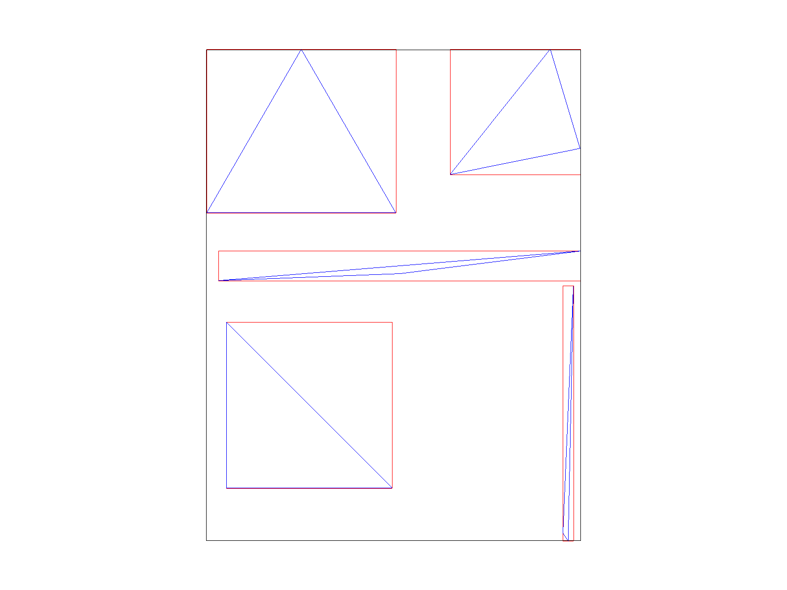

# Project 1

## Project Overview
This project primarily dealt with the development of an SVG rasterization pipeline for points, lines, and triangles which can, optionally, be transformed, colored according to a barycentric system, or textured using an image. Special care was given throughout the project to generating high quality rasterization by supporting both super-sampling to improve quality for smoother edges and coloring where continuously defined as well as more interesting texture oriented anti-aliasing features like bi-linear pixel sampling and mipmap level interpolation. When taking all of these features together, we've created a not only fairly capable but indeed high quality SVG rendering engine which can be used to display very complex images.

Through this project, I feel that I've learned a *lot* about different anti-aliasing techniques. Specifically, while I feel I had a general grasp on the continuous-mipmap level texture filtering technique after our course lectures on the topic, actually implementing it provided a much stronger understanding of it. Additionally (and somewhat unexpectedly), this project gave me a much deeper understanding of the LLVM compiler infrastructure as I attempted to root-cause what turned out to be a miscompilation stemming from incorrect vectorization. This tangent, while not exactly relevant to the class, was interesting both to my own interests in programming languages/compiler research as well as because it gave me a much more low-level look at triangle intersection code.

## Part 1 (Triangle rasterization)
My project uses a very simple sampling based method for rasterizing triangles.

First, we compute the bounding box for each triangle:

This is done by simply computing the minimum and maximum x and y coordinates across all of the triangle's vertices. This bounding box gives us a much smaller sample space from which we can perform intersection tests and is thus performance critical.

Next, we arbitrarily define the three lines L\_{01}, L\_{12}, L\_{20} and consider only the portion of those lines that falls within the earlier defined bounding box (i.e. the line tangent vectors):

Then, for each point in the bounding box, we can consider which "side" of the line it lies on. If the pixel lies on the same side of each line, we know the pixel must be contained within the triangle and may thus color that pixel appropriately. This leads to the following final rasterization result for `basic/test4.svg` (default viewing parameters):

While this works and the triangles are in fact rasterized correctly, this does lead to a great deal of aliasing. One particularly extreme case of this can be seen in the pixel inspector where the red triangle, in addition to its abundant jaggies, appears to become discontinuous for a period since it becomes so narrow as to not be considered inside of any of the pixels in the region. This is the correct behavior but it is not very visually appealing.

From a performance standpoint, we can conclude that this algorithm is no worse than one that checks every sample within the bounding because this algorithm is constrained to checking *only* the pixels in the bounding box. In other words, this algorithm is not worse than one that does this because the algorithm presented here does precisely that.

