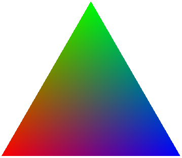
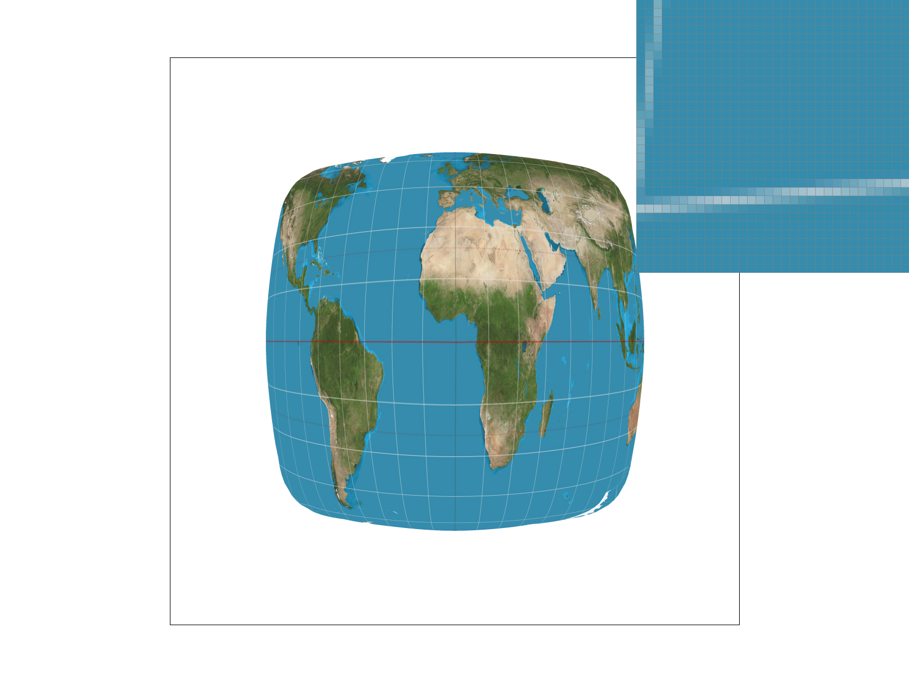
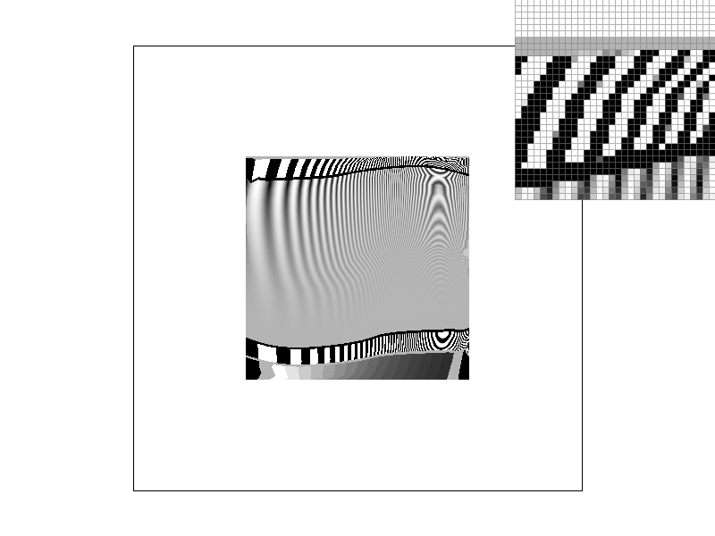

# Project 1

## Project Overview
This project primarily dealt with the development of an SVG rasterization pipeline for points, lines, and triangles which can, optionally, be transformed, colored according to a barycentric system, or textured using an image. Special care was given throughout the project to generating high quality rasterization by supporting both super-sampling to improve quality for smoother edges and coloring where continuously defined as well as more interesting texture oriented anti-aliasing features like bi-linear pixel sampling and mipmap level interpolation. When taking all of these features together, we've created a not only fairly capable but indeed high quality SVG rendering engine which can be used to display very complex images.

Through this project, I feel that I've learned a *lot* about different anti-aliasing techniques. Specifically, while I feel I had a general grasp on the continuous-mipmap level texture filtering technique after our course lectures on the topic, actually implementing it provided a much stronger understanding of it. Additionally (and somewhat unexpectedly), this project gave me a much deeper understanding of the LLVM compiler infrastructure as I attempted to root-cause what turned out to be a miscompilation stemming from incorrect vectorization. This tangent, while not exactly relevant to the class, was interesting both to my own interests in programming languages/compiler research as well as because it gave me a much more low-level look at triangle intersection code.

## Part 1 (Triangle rasterization)
My implementation uses a very simple sampling based method for rasterizing triangles.

First, we compute the bounding box for each triangle:

This is done by simply computing the minimum and maximum x and y coordinates across all of the triangle's vertices. This bounding box gives us a much smaller sample space from which we can perform intersection tests and is thus performance critical.

Next, we arbitrarily define the three lines L\_{01}, L\_{12}, L\_{20} and consider only the portion of those lines that falls within the earlier defined bounding box (i.e. the line tangent vectors):

Then, for each point in the bounding box, we can consider which "side" of the line it lies on. If the pixel lies on the same side of each line, we know the pixel must be contained within the triangle and may thus color that pixel appropriately. This leads to the following final rasterization result for `basic/test4.svg` (default viewing parameters):

While this works and the triangles are in fact rasterized correctly, this does lead to a great deal of aliasing. One particularly extreme case of this can be seen in the pixel inspector where the red triangle, in addition to its abundant jaggies, appears to become discontinuous for a period since it becomes so narrow as to not be considered inside of any of the pixels in the region. This is the correct behavior but it is not very visually appealing.

From a performance standpoint, we can conclude that this algorithm is no worse than one that checks every sample within the bounding because this algorithm is constrained to checking *only* the pixels in the bounding box. In other words, this algorithm is not worse than one that does this because the algorithm presented here does precisely that.

## Part 2 (Antialiasing by supersampling)
Conceptually, supersampling antialiasing (SSAA) works to combat aliasing by simulating a higher sampling frequency (thereby increasing the Nyquist frequency) and then lowering the higher frequency samples into the lower frequency screen sample rate. In effect, this means we render a scene at a much higher resolution and then downsampling (typically by averaging neighboring samples). This is useful in practice since it allows us to provide much smoother edge transitions.

To add SSAA to our rasterization pipeline, we had to make a handful of changes. 

To begin, we defined our SSAA rate as the number of pixels that are unified to create one super pixel. This means that an SSAA rate of 4x means four pixels (arranged in a 2x2 square) are averaged together to form each screen pixel. We store this square-rooted rate (ie the dimension of one edge of the square) in the rasterizer's `sample_rate` field as we have no actual use for the non-square rooted size and because computing the square root is computationally expensive and thus something worth caching.

Next, since we now wish to render more pixels, we need an appropriately large place to store them. This meant that we needed to scale up the `sample_buffer` by a factor of  `sample_rate` in each dimension. This is very expensive (costing 16x more memory for 16x SSAA) but doing so vastly simplifies the pipeline since it allows us to directly render the entire scene into the sample buffer and then, later, downsample into the frame buffer instead of attempting to perform both operations simultaneously.

With this new, expanded sample buffer, we now need to render into it. This required two changes. 

First, to draw points and lines correctly (and un-supersampled per the spec), we simply modified the `fill_pixel` to translate from frame buffer coordinates to sample buffer coordinates by scalding each dimension up by `sample_rate` and then drawing a cluster a `sample_rate` by `sample_rate` square centered approximately at that newly scaled up position. This preserves the existing behavior for points and lines since the later down sampling algorithm will merge all the pixels in this square into one super pixel in the frame buffer.

Finally, with all elements rendered into the frame buffer, we are now prepared to reduce the sample buffer into the frame buffer. We did this by modifying the `resolve_to_framebuffer` function to iterate the frame buffer and average the colors of the corresponding `sample_rate` by `sample_rate` square of pixels in the sample buffer into one super pixel in the frame buffer. Once this processing step is complete, the SSAA image is now available in the frame buffer in its final form.

As a result of all this, triangles have significantly smoother edges since the sharp transition which appears in the sample buffer is averaged away into an appropriately smooth edge which approximates the very high frequency change, as desired. This provides a very visually appealing effect:

| 1x SSAA | 4x SSAA | 16x SSAA |
|:---:|:---:|:---:|
||||

By revisiting the pointy end of red triangle we observed in part 1, we can very clearly observe both the effect and extent of the varying levels of SSAA. SSAA at 1x, as expected, results in no changes since the super pixels are made up of just one sample each. In 4x, however, we start to see significant improvement both in the jaggedness and the size of the discontinuity because SSAA 4x is able to communicate varying levels of "edge present" through *hue* (unlike its binary 1x counterpart) due to its supersampling behavior. Thus, SSAA 4x is able to smoothly communicate the edge fall off behavior happening inside a single pixel by observing the edge fall off behavior across the four sub-samples. In 16x, we see an effect similar to 4x but slightly more pronounced. Notably, this rendition has no visible discontinuities. This is possible in 16x but not 4x because the larger sample footprint of 16x allows it to capture the extremely skinny part of the triangle due to its much smaller sub-pixels and thus much higher sampling frequency.

## Part 3 (Transforms)
In this part, we implemented the SVG scale, rotate, and translate transformations. I used these transformations to create a robot ice skating.

## Part 4 (Barycentric coordinates) 
In this task, we implemented barycentric color interpolation for our triangles.

Put succinctly, a barycentric coordinate system is an interpolation strategy in which various `n` samples are linearly and continuously interpolated (or "combined") according to an `n - 1` dimensional coordinate in the interior of that geometric object. The closer a point in the object is to a specific vertex, the more heavily that vertex's sample is weighted in the combination while still maintaining that the sum of the weights is equal to exactly 1.

We can see this more easily in the case of a triangle (`n = 3`). In the triangle above, we have the color green associated with the top vertex V\_g, red with the bottom left vertex V\_r, and finally blue with the bottom right vertex V\_b. The barycentric coordinate system is then used to interpolate the color across each of the points in the triangle. 

We can make a few key observations. First, the points exactly at the vertices are exactly the sample colors (i.e. the color at point V\_g is exactly (0, 1, 0)). This makes sense since the point is maximally far from both V\_r and V\_b and thus must be maximally green. More interestingly, however, is the point exactly halfway between V\_r and V\_b. This gives us a nice purple which, if we recall from art class, is a mix of half red and half blue. Specifically, the shade here is (0.5, 0, 0.5) since it is a mix of half of the red sample and half of the blue sample since we are maximally far from green in this case. A similar effect may be observed at the other halfway edges (red-green forms yellow, blue-green forms teal/cyan). While seeing this same concept when moving off of the edges and into the interior space of the triangle is a bit trickier, we can see it at work in that there are no visibly sharp changes in color moving a single step in any direction on the triangle since the weights (and thus the mix) change smoothly due to the barycentric coordinate system.

We can use barycentric coordinates to smoothly texture a variety of useful images. For example, this is a color wheel which linearly interpolates color around the circle (`basic/test7.svg`, default viewing parameters/SSAA=1x):

## Part 5 (Pixel sampling/texture mapping)
While the textures we are applying to our triangles already rasters, a mapping pseudo-step function may be constructed that perfectly maps f(x, y) to the color data at x, y in the rasterized image when sampling the raster at a 1:1 scale.

We run into the familiar set of problems when attempting to deviate from this 1:1 scale in either direction. This is to be expected, naturally, because our raster is a function that we must sample. For this reason, we can and often do refer to texture mapping as "pixel sampling" since the problems are one and the same. Just as with other functions, sampling it too slowly can result in aliasing because we miss detail where as sampling it more quickly than the underlying raster supports can result in missing data which must be interpolated.

This last issue about interpolation is one we tackled in this problem. Here we implemented two separate sampling schemes, namely nearest and bi-linear sampling. Nearest is the most basic scheme as it simply "snaps" coordinates to the nearest valid sample in the raster. This can result in visible blockiness since multiple different pixels may be returned the same sample from the raster under this scheme. To rectify this, another sampling scheme known as bi-linear sampling may be used. Bi-linear sampling linearly interpolates the color of a sample from the four nearest pixels. This means that different samples, even when they have the same underlying four nearest pixels, will have differing sample data, which provides a smoother overall appearance. 

We can see a striking difference between these sampling methods by zooming into an image:

| Nearest | Bi-linear |
|:---:|:---:|
|||

In the nearest image, we can clearly see sharp edges between individual pixels from the raster whereas the in the bi-linear image the transition between raster pixels is much smoother and something that can be easily overlooked.

Finally, we compare these two sampling methods and their interactions with SSAA and their impact on anti-aliasing. 

| 1x SSAA, nearest | 16x SSAA, nearest |
|:---:|:---:|
|||

| 1x SSAA, bi-linear | 16x SSAA, bi-linear |
|:---:|:---:|
|||

While, unsurprisingly, 16x SSAA of either interpolation scheme performs better than either 1x SSAA interpolation scheme, 1x SSAA bi-linear interpolation trades blows with 16x SSAA nearest despite needing just 1/16th of the memory and 1/16th of the processing time, which suggests it is a very good technique for efficiently resolving texture aliasing. This is not a terribly suprising result as bi-linear interpolation performs a similar function as 4x SSAA in that it captures more detail by combining neighboring samples except that it requires much less memory. Between the two 1x SSAA interpolation methods, bi-linearly again, unsurprisingly wins due to its increased ability to capture detail. A similar trend appears with 16x SSAA where bi-linear sampling plays off of 16x SSAA to produce a very smooth result whereas 16x SSAA struggles due to nearest magnifying errors.

Generally, however, we may conclude that the difference between these two sampling methods is most severe when the frequency is very high and the resolution of the underlying raster is very low. In this case, nearest will be forced to pick one of the two colors for all pixels on screen leading to severe blockiness whereas bi-linear will be able to more appropriately cope with both the frequency and aliasing issues.

## Part 6 (Level sampling)
Level sampling is a technique which uses mipmaps, or progressively smaller pre-filtered variants of a texture, to resolve aliasing caused by texture minification. As discussed in part 5, this is resolves a problem caused by the texture's frequency, due to its high resolution but small screen size, is too high for the screen and thus becomes aliased. 

We implemented two variants of level sampling in our project; namely, nearest and linear. For each, the texture level was computed by observing the rate of change in texture coordinates between individual pixels in both the x and y direction (higher rates, naturally, indicating a larger display size) and then using the maximum rate of change to compute the level. These levels are then interpreted different by each scheme. In nearest, the level is simply snapped to the nearest mipmap level (clamping at the edges) and the pixel is directly sampled from that mipmap texture whereas in linear the two nearest levels' samples are linearly interpolated according to the continuous level value in order to provide a mixed approximation of the two.

To showcase the performance of the nearest level sampling engine, we now consider four samples which use the two different pixel sampling methods from above and compare them across the L\_ZERO technique (no mipmap-ing) and L\_NEAREST (nearest):

| L\_ZERO, P\_NEAREST | L\_ZERO, P\_LINEAR | L\_NEAREST, P\_NEAREST | L\_NEAREST, P\_LINEAR|
|:---:|:---:|:---:|:---:|
|||||

From this, we can make some key observations. First, and most poignantly, applying the correct mipmap level is significantly more important than sampling well when aliasing is a concern. This is because, despite bi-linear sampling performing well against aliasing in part 5, it is much easier to *prevent* aliasing from occurring in the first place than it is to attempt to recover from it through averaging after the fact. This is visible between the zero, linear and nearest, nearest images in which even with the inferior sampling algorithm the later displays significantly less aliasing. Despite this, however, we should not conclude that good sampling is totally irrelevant. Rather, the different between nearest, nearest and nearest, linear is still quite visible, albeit less severe and bi-linear sampling still results in better quality.

With all these techniques under our belt, it now comes time to consider all of them together. We analyze each under the categories of speed, memory usage, and antialiasing power.

Where better to start than where it all began: SSAA! SSAA is best characterized as the sledge hammer of antialiasing. It is very effective in nearly every situation but, unfortunately, it has such severe computational and memory penalties that it is almost unacceptably expensive at higher levels for any sort of real-time applications. This means that SSAA is a great tool for things like animations and movies but not so much a great choice for something like mobile games.

Pixel sampling is the cheapest remedy of the bunch but, unfortunately, has one of the more minor impacts. While the nearest sampling technique is essentially free in that it is the minimum viable functionality required to texture a surface, it also provides the worst quality. Bi-linear sampling provides good local anti-aliasing (equivalent to SSAA 4x) without any additional memory pressure but at the cost of a small number of additional computations per pixel. For this reason, I feel that bi-linear texture sampling is a benign good feature in almost any rendering pipeline.

Finally, we consider level sampling. Level sampling is a *very* powerful tool for stopping aliasing before it occurs. It does, however, incur a non-zero memory cost (up to \~33%) but, given the falling cost of DRAM and its marginal amount of easily vectorized computation, it is a very good choice for anti-aliasing especially when computational resources enable linear level sampling.

